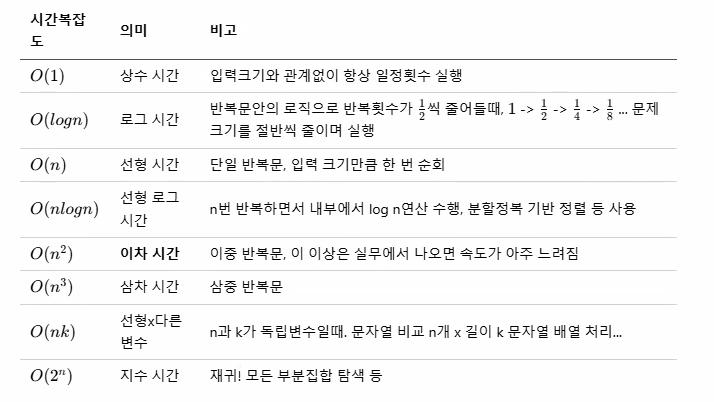
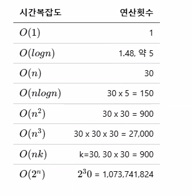

# IoT-algorithm-2026
IoT개발자 과정 자료 구조/알고리즘 리포지토리

##개요

###자료 구조
- 데이터를 구성하는 구조, 데이터를 요구에 따라 처리할때 효율적으로 처리 하기 위해서 
- 자료(data) + 구조(structure) => datastructure
- 자료형(datatype): int, double,char...
- 자료형(DS): 배열, 구조체 이후
- 주소록 -> 구조체로 구성된 배열(크기 고정),구조체 포인터(동적 조정 가능)

-종류
    - 단순형: 문자,정수,실수,문자열...
    - 선형: 배열, 리스트,스택,큐
    - 비선형 자료 구조: 트리,그래프
    - 파일: 순차 파일, 색인 파일....

### 알고리즘
- 정의 
    -프로그램: 데이터를 처리하는 소프트웨어 
    - 데이터를 처리할때 문제를 해결하는 논리적인 방법과 순서

- 필요 요건
 - 입력: 알로리즘 외부에서 제공되는 자료가 필요
 - 출력: 최소 1개 이상의 결과 도출이 필요
 - 명확: 각단계가 애매함이 없어야 함
 - 유한성: 유한한 횟수를 거친수 문제 해결, 종료
 - 효과성: 유한한 시간안에 수행 할수 있을 정도로 단순

- 복잡도
    - 시간 복잡도 :  자료수 n이 증가 할때 시간이 얼마 만큼 증가 하는지 판단
    - 공간 복잡도: 자료수 n이 증가 할때 메모리를 얼마 만큼 사용하는지 판단, 임베디드/ 펌웨어에서는 중요

- 종류
    - 정렬: 삽입,선택,버블,쉡,퀵
    - 탐색: DFs(깊이 우선 탐색),BFS(너비 우선 탐색), 이진 탐색
    - 그래프: 다익스트라, 벨먼-포드, A*
    - 그리디 알고리즘, 백트래킹, 분할 정복
    - 동적 계획법: 메모이제이션
    - 인공지능: 신경망, SVM(서포트 벡터 머신), 회귀 분석...
    - 운영 체제: 세마포어, 뮤텍스, 데드락,멀티 테스킹, 멀티스레드
    - 네트워크: QoS,라우팅
    - 암호화: AeS,DES,SEED, MD5,RSA.... 

    - 참조 웹 사이트
    
- 현재 IT개발에서 직접 알고리즘을 개발할 일은 거의 없다. 
    - 특정 개발시 어떠한 자료 구조와 어떤 알고리즘을 쓰는게 효과적인지를 습득 하기 위해서 미리 만들어진 알고리즘을 잘 활용 하면 된다. 

### 자료구조/ 알고리름 예제

1. 알고리즘 핵심
    - 순서도

2. 메모리 구조
    - 코드 영역 - 소스코드 저장 되는 부분
    - 데이터 영역 - 전역, 정적 변수 할당, 프로그램 시작시 할당 되고, 프로 그램 종료시 메모리 해제
    - 스택 영역- 함수 호출시 생성 되는 지역 변수, 매개변수 저장, 함추 호출 완료시 메모리 해제
    - 힙 영역  - 동적ㅇ로 메모리 할당, malloc,calloc,realloc,와 연계

3. 자료 구조
    - 배열
    - 포인터       
    

 ### 검색 알고리즘
 1. 검색 - search, 데이터 집합에서 원하는 값을 가진 요소를 찾아 내는것

 2. 선형 검색
    - 배열의 모든 요소를 순차적으로 검색
    - 찾는 요소가 있으면 그 위치에서 빠져 나감
    - 찾는 요소가 없으면 배열의 마지막 까지 비교 - 단점
 3. 이진 검색    
    - 데이터가 키값으로 이미 정렬 되어 있다는 가정하에 시작 - 단점
    - 찾는 요소가 있든 없든 검색 횟수가 비약적으로 줄어든다.

4. 복잡도(complexity)
    - 시간 복잡도: 실행에 필요한 시간을 평가
        -참조: [간단내용](https://namu.wiki/w/%EC%8B%9C%EA%B0%84%20%EB%B3%B5%EC%9E%A1%EB%8F%84)
        -[복잡 내용](https://ko.wikipedia.org/wiki/%EC%8B%9C%EA%B0%84_%EB%B3%B5%EC%9E%A1%EB%8F%84)
    - 공간 복잡도: 기억 영역, 파일 공간등 물리적인 공간을 얼마나 필요로 하는지 평가
    - 복잡도 표현 함수: O(영문자 대문자 오, 빅오)
    - 선형 검색 시간 복잡도: $O(n)$
    - 이진 검색 복잡도: $O(log n)$

   

   - 예: n이 30이면 

   

### 현재 과정 학습 로드맵
1. 언어
    -'c', c++,sql,python,c#,html,css,js

2. 기술
    - 기초 프로그래밍,알고리즘,통신프로그램,데이터분석,웹개발,윈앱개발,IoT

### 스택과 큐 자료 구조

    - 스택
        - 한쪽 끝이 막혀 있음 접시를 쌓는 구조와 동일한 자료 구조
        - 맨 처음에 쌓인 접시는 위의 쌓여 있던 접시가 모두 제거 되어야 꺼낼수 있음
        - LIFO( last in first out) - 후입 선출

    - 스택 용어
        - push: 스택에 데이터 삽입 작업
        - pop: 스택에서 데이터 꺼내는 작업
        - peek: 스택의 마지막에 들어있는 데이터를 확인
        - bottom: 스택의 가장 바닥
        - top: 스택의 가장 위
    
    - 큐
        - 양쪽이 다 열려 있어서 한쪽에서 데이터를 추가, 반대에서 데이터를 꺼내는 자료 구조
        - FIFO(first in first out): 선입선출     

    - 큐 용어
        - enqueue: 큐의 끝에 데이터 삽입 작업
        - dequeue: 큐의 앞에서 데이터 추출 작업
        - front: dequeue를 수행할 큐 맨 앞자리
        - rear: enqueue를 수행할 큐 맨 뒷자리

    - 큐를 배열로 구현시 단점
        - dequeue를 실행하면 배열 맨 앞자리가 빔
        - 빈자리를 뒤의 데이터로 채우는 부가작업이 필요
        - 보통 큐는 배열 보다 연결 리스트로 구현 또는 원형 큐로 구현      

    - 원형큐[소스](./basic/practice/practice2/practice2.vcxproj)
        - 일반 큐 단점(빈자리 없애기 추가 로직)    
        - (front +i)%max에 대해서 이해 할것

    - Deque(데크)
        - 스택과 큐를 합친 자료 구조
        - 앞에서 인큐,디큐, 뒤에서 인큐, 디큐가 모드 가능한 구조    

### 재귀 알고리즘[소스](./basic/algorithm03/app05/app05.vcxproj)
    - 1. 사전적 의미: 본디의 곳으로 다시 돌아 오는것
    - 함수나 자기 자신의 함수를 호출하여 더 작은 하위 문제를 해결하는 프로그램 기법

    - 팩토리얼

    - 재귀 분석 [소스](./basic/algorithm03/app04/app04.vcxproj)     
        - 하향식 분석 - 트리 형태로 분석
        - 상향식 분석 - 표/점화식 전개 분석

        
        -  하향식 분석
        
        - 상향식 분석
        recur(5)풀이" recur(4)'5'recur(3)  - recur(n-1)n recur(n-2)

    - 재귀 알고리즘 비재귀적으로 변경 [소스](./basic/algorithm03/app06/app06.vcxproj)
        - 재귀 호출이 처리 속도를 느리게 만드는 경우가 많음
        - 비재귀적으로 변경하면 속도 향상에 도움

    - '메모이제션'
        - 특정 조건(재귀, 동일한 부분 문제 반복,입력 크기 규모)에서 매우 강력한 성능 향상 기법
        - 이미 계산한 결과를 저장해두고 다시 호출하면 재계산 하지 않고 결과를 반환, 사용
        - 동적 계획법에 많이 사용    

        - 단점 - 메모리를 많이 사용, 프로그램이 비정상 종료 될수가 있다.
        - 시간 복잡도는 줄이고 공간 복잡도를 늘리는 방식
        - 
### 정렬 알고르즘         

